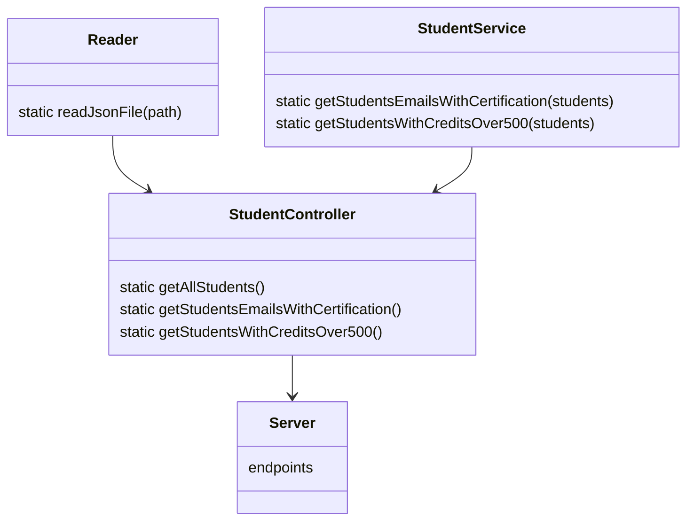

# API de cursos de Visual Thinking
Requerimientos:

1. Habilitar un endpoint para consultar todos los estudiantes con todos sus campos.
2. Habilitar un endpoint para consultar los **emails** de todos los estudiantes que tengan certificación **haveCertification**.
3. Habilitar un endpoint para consultar todos los estudiantes que tengan **credits** mayor a 500.


# Dependencias

El archivo [.gitignore](https://github.com/EduardoMorales98/Cursos-de-Visual-Thinking-API/blob/main/.gitignore) hace que no se versione la carpeta **node_modules**, la cual es generada al instalar alguna dependencia.


## 1.- Jest
Esta dependencia es usada para crear las pruebas de unidad. Se instaló mediante el siguiente comando:
>npm install jest@26.0.0 --save

Para automatizar las pruebas se agregó el siguiente script en el [package.json](https://github.com/EduardoMorales98/Cursos-de-Visual-Thinking-API/commit/540c98b5acd202a99de236b9cd06fc2dca5fd156):

>"test": "jest"

Con ello basta con ejecutar:
>npm run test

para correr todas las pruebas de unidad.

## 2.- Express
Esta dependencia es usada para crear el servidor para la API. Se instaló mediante el siguiente comando:
>npm install express --save

Para automatizar el inicio del servidor se agregó el siguiente script en el [package.json](https://github.com/EduardoMorales98/Cursos-de-Visual-Thinking-API/commit/eb5831bbf07710f50de043a412d288107cd5e29a):

>"server": "node ./lib/server.js"

Con ello basta con ejecutar:
>npm run server

para que el servidor se inicie.


## 2.- Linter
Esta dependencia es usada para ayudarnos a cuidar la legibilidad en nuestro código. Para instalar ESLint se ejecutó el siguiente comando:
>npm install eslint --save-dev

Se ejecutó el  siguiente comando para generar la configuración del linter:
>npm init @eslint/config

Terminado esto se crea el archivo [.eslintrc.js](https://github.com/EduardoMorales98/Cursos-de-Visual-Thinking-API/commit/9333748351c329491ddc9f68817560ec8b2f4893), en donde se agregaron las siguientes **"rules"** para decirle al Linter que aspectos revise en nuestros archivos:
```javascript
indent: ["error", 4],
"linebreak-style": ["error", "unix"],
quotes: ["error", "double"],
semi: ["error", "always"]
```

También se agregó la siguiente línea en **"env"**:
>"jest": true

Para automatizar los comandos de eslint se agregan los siguientes **"scripts"**  en el [package.json](https://github.com/EduardoMorales98/Cursos-de-Visual-Thinking-API/commit/9333748351c329491ddc9f68817560ec8b2f4893):
```javascript
"linter": "node ./node_modules/eslint/bin/eslint.js .",
"linter-fix": "node ./node_modules/eslint/bin/eslint.js . --fix"
```
Después de ello se puede ejecutar:
>npm run linter

para que el linter se ejecute y muestre todas las inconsistencias de escritura.

El Linter arregla todos estos detalles por ti. Ejecutando el comando:
> npm run linter-fix 

tus archivos ahora quedarán con el mejor formato.


# Diagrama de clases


## Reader
Esta clase se usa para leer el archivo [visualpartners.json](https://github.com/EduardoMorales98/Cursos-de-Visual-Thinking-API/blob/main/visualpartners.json), el cual contiene todos los datos que serán usados en la API. Tiene como parámetro **path**, que será la ruta en donde se encuentra nuestro archivo.

## StudentService
Esta clase contiene la lógica para obtener los datos esperados. Cuenta con dos métodos que corresponden con el cumplimiento de los requerimientos 2 y 3. Ambos reciben como parámetro **students**, que serán los datos provenientes de [visualpartners.json](https://github.com/EduardoMorales98/Cursos-de-Visual-Thinking-API/blob/main/visualpartners.json).

## StudentController
Esta clase es la que conecta a las dos anteriores con el servidor [server.js](https://github.com/EduardoMorales98/Cursos-de-Visual-Thinking-API/blob/main/lib/server.js). En esta se tienen tres métodos, el primero es **getAllStudents()**, que accede a todos los datos del archivo [visualpartners.json](https://github.com/EduardoMorales98/Cursos-de-Visual-Thinking-API/blob/main/visualpartners.json) mediante la clase [Reader.js](https://github.com/EduardoMorales98/Cursos-de-Visual-Thinking-API/blob/main/lib/utils/Reader.js). Este método es usado por los otros dos para mandar los datos a los dos métodos de la clase [StudentService](https://github.com/EduardoMorales98/Cursos-de-Visual-Thinking-API/blob/main/lib/services/StudentService.js), y de esta manera solo se mandaría a llamar estos tres métodos en el servidor para la API, comunicándose directamente con esta clase e indirectamente con las dos anteriormente mencionadas.

# API

| Endpoint    | Request | Response   |
| -------  | ------   | -------  |
| `localhost:3000/`           | `localhost:3000/`| Mensaje de bienvenida al API de cursos de Visual Thinking. |
| `localhost:3000/v1/students`| `localhost:3000/v1/students`| Lista de todos los estudiantes con todos sus campos. |
| `localhost:3000/v1/students/emails`| `localhost:3000/v1/students/emails`| Lista de los **emails** de todos los estudiantes que tienen certificación   **haveCertification**. |
| `localhost:3000/v1/students/credits`| `localhost:3000/v1/students/credits`| Lista de todos los estudiantes que tienen **credits** mayor a 500.  |

## Pruebas de los endpoints

Para abrir el servidor basta con ejecutar el comando:
>npm run server

Y acceder al URL del edpoint que se desee obtener respuesta. A continuación se muestran los resultados de cada edpoint mencionado en la tabla anterior.

- 


- 


- 

- 
