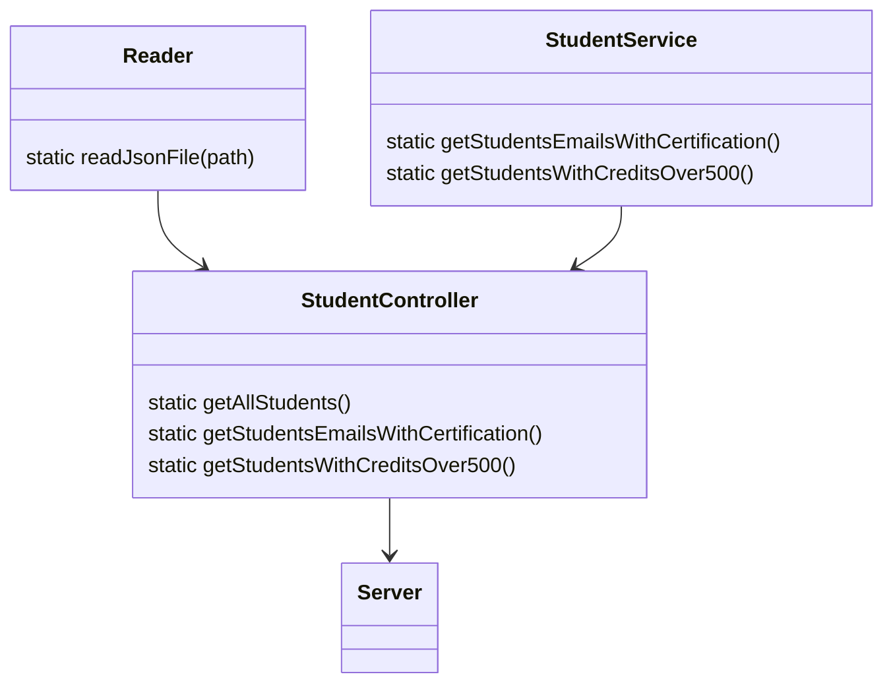

# API de cursos de Visual Thinking

```mermaid
classDiagram

      Reader --> StudentController
      StudentService --> StudentController
      StudentController --> Server
      class StudentController{
          static getAllStudents()
          static getStudentsEmailsWithCertification()
          static getStudentsWithCreditsOver500()
      }
      class StudentService{
          static getStudentsEmailsWithCertification()
          static getStudentsWithCreditsOver500()
      }
      class Server{
          
      }

      class  Reader{
          static readJsonFile(path)
      }
```